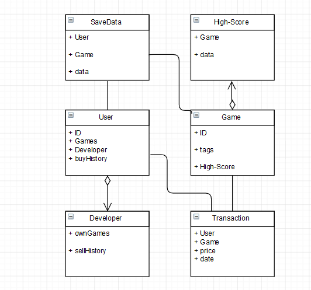

# Final Submission

## Team
Santeri Mahlamäki

Niko Hakanen

Olli Keisanen

## Implemented features
Below are listed the features we implemented into our website. The numeric value inside parenthesis is the point value we'd like to give to ourselves for each feature.

### Authentication(200/200 points)
In our website, it is possible to do all, login, logout and register a new user. These were implemented using the Django auth, as was requested. Email validation
is implemented so that the activation link is printed to the console.
All features requested were implemented and they all work. Thus we'd expect full points.

### Basic player functionalities(280/300 points)
In our website, it is possibe to buy games, play games and search for games using category-sorting. We used the given payment system for our buy -feature. Players should not be able to play games they haven't bought, since the purchase-status is checked from the database. However, some more work could have been put into the search-mechanism: a simple search tag -feature could arguably be better than a simple category-sorting. Also, adding games to the shopping cart may not be so intuitive: no message of a successfull addition to the shopping cart is displayed, it just appears there when checked. Otherwise, everything was implemented, tested and seen to work, and thus we see 280/300 points justified.

### Basic developer functionalities (200/200 points)
Developers are able to create new games by providing URL to the game, giving it a name, price and thumbnail. Any of the data is possible to modify after the creation of the game, and the entire game can also be removed. Security is taken care of: we couldn't find a way for users/developers to edit or remove the games of other developers. Also, the developer can view the inventory statistics of their games via looking them up from their profile: sale statistics are displayed for each game in their own charts. However, it's not possible to limit the chart's time-box.
Again, everything that was needed to be implemented, is implemented and working fine. Thus, we'd justify full points.

### Game/Service interaction(200/200 points)
Our website supports all the listed features of the given message_protocol: SCORE, SAVE, LOAD_REQUEST, LOAD, ERROR and SETTING. The highscores for the given game is displayed next to the game, displaying the top 5 highscores made to the game. If the player reaches a new highscore, the highscores are automatically updated.
Saving and loading game states work as intended. The website also sends ERROR messages whenever sufficient load-data cannot be found. The iframe containing the game also changes its dimensions according to the SETTING message's parameters.
Everything in the message protocol is implemented and working well, thus we'd expect full points for this.

### Quality of Work(70/100 points)
The code is readable and clear, although our team members seemed to have differing quality guidelines, making the style somewhat inconsistent. The functionality was well divided according to the Model-View-Template separation. Functions were written whenever we saw a need for similar usage elsewhere, in order to follow the DRY-principle. Most difficult parts were commented, but overall commenting was rather lazy. However, nothing TOO difficult was done during the project, so it is arguable whether or not more commenting would have been relevant. Also, we think that the UI is clear, but VERY lacking in visual appeal. Thus, we would like to give ourselves 70 points for this section.

### Non-functional requirements(200/200 points)
Of course, since the demo has not been held yet, we really cannot assess our success regarding it, so we've excluded it from the criteria of this section. In our opinion, our project plan was well thought-out. We were able to follow it throughout the project, although we didn't follow the schedule too strictly. Considering our initial lack of knowledge regarding web-development, we were able to identify risks and develop working methods to counter them. Teamwork worked surprisingly well, even considering the fact that we worked remotely almost exclusively. At the beginning we used Trello for coordination, but it quickly became obsolete, since we communicated nearly daily using Telegram. Our habits in using git was appropriate, and we did not counter any difficulties pushing or pulling code. Deployment to Heroku, however, caused some problems here and there. All in all, we see our project as a success from the project management point-of-view. Sufficient thought and effort was being put to the documentation and we consider the quality of our documents sufficient.
All in all, we did not see any reason to substract points from this section, and thus we'd give ourselves full points for this.

## More Features

### Save/load and resolution feature(100/100 points)
As stated in the Game/Service interaction -section, the save, load and settings message-protocols were implemented and working as intended. It is possible to save and load gamestates and alter the dimensions of the iframe that contains the game. Thus, we'd justify full points for this section.

### Own Game (100/100 points)
We did develop our own test game. It is a very primitive Quiz -game, with questions and answers being presented in random order. The questions are picked at random from a set of 5 pre-defined questions and answers.
The UI of the game is very primitive, and the question-pool's size is only 5, the same amount that the game asks questions. However, it was stated that "going a little beyond the given example test game is enough", so we would not see this as a problem.
The game does support SCORE, LOAD, LOAD_REQUEST, SAVE and SETTING messages, and they are working as expected. The game is hosted in the /static/QUIZGAME/ folder of the project.
Since all the requirements are met, we'd expect full points for this section.

### 3rd Party Login (100/100 points)
3rd party login was implemented using social_auth with twitter as the 3rd party authenticator. Login can be accessed from the navigation bar twitter link. Login works as expected. It is not possible to register as developer through a 3rd party but we feel like this is acceptable since developers should register their information to the site anyways. Thus, we'd justify full points for this section.

All in all, we'd see 1450 a justified score for our entire project.

## Dividing the work
It is rather difficult to really separate who did what: team members where more or less involved in everything, with some exceptions:
Niko implemented the registration, email-validation and inventory statistics almost exclusively.
It was Olli who created the login/logout feature, and integrated the payment mechanism. Also, the checking of game ownership was also taken care by Olli.
Santeri coded the initial models, messaging-protocols and our own game.
The rest, i.e. the CSS, templates, different views etc., were more or less shared by at least two individuals, and numerous fixes and improvements were developed by everyone to almost everything. Our team feels that the workload was shared evenly, and everyone got equal chance for learning and practice.

## Link to application and instructions
Our website can be found at https://mighty-thicket-65245.herokuapp.com/
There are three pre-registered users, with usernames and passwords as admin:admin, dev:dev and user:user, respectively.

There exists two games, one and two, both owned by the dev. Game 'one' is the course's example game, and 'two' is our own game.
The user has purchased the 'one' game, and it is accessible from the 'My Games' menu. Both games are visible in the main-page, and can be filtered with the category-filters to the left.
Buying a game is done via going to the game that we want to purchase ('two' in this case, unless others are added) and clicking 'Add to Basket' -button. The game is then added to the basket, in which the final transaction can be made using the mock-up payment-service.
Developer dev can view the statistics of their games via going to the 'profile' menu. Here, all their games are listed. Clicking the 'show details' texts under the games displays the sales charts of the given game. A new game can be added via clicking the 'Add new game' link and filling the required information. By clicking the game icons, the developer can play their own games, as well as make modifications or delete the games.

# Project Plan

## Team
Santeri Mahlamäki

Niko Hakanen

Olli Keisanen

## Goal
The goal of this project is to implement a simple game hosting site using Django's framework, and deploy it into Heroku. We expect to get used to the tools and methods taught during the lectures and exercises, and also develop a better understanding what it takes to build a working web application. Our goal is to implement all the 'mandatory requirements', and additionally a sufficient set of extra features to achieve the highest grade.

## Plans

### Tentative architecture
Initially, we think that we're going to need models for following: a user, which contains user information, including developer status, list of purchased games etc., a developer, which contains developer specific data, such as own games and tools, a transaction, which records all purchases and relevant information regarding them, a game, which contains an identifier, search tags, a reference to high scores etc., a high-score, which tracks the high scores for each game, and a savedata, which contains the saved data for user for each of their games.

### Features
#### Authentication
We will use Django auth for implementing the authentication. More research on how it works is required.

#### Basic player functionalities
Games are searched with search tags or categories. Purchasing games is handled with a mock-up payment service. Transactions are stored into Transaction -model. Games are played by opening the game's own page, which loads the game from the original source. High-scores are saved into the High-Score -model. As for security, some more investigation is required to ensure the prevention of unauthorized playing.

#### Basic developer functionalities
Developers are told apart from players by the reference from User -model to Developer -model: if such exists, the user is a developer, and the model contains additional information. Games have information about their creators, and other information assigned by the developer, like price. Transactions keep track of all the purchases, so sales statistics can be derived from them. As for security, some more investigation is required to ensure the prevention of unauthorized playing.

#### Game/Service interaction
Communication between games and the service will be implemented as instructed in the instructions. High-scores will be saved into the High-scores model, and possible saved game states into the SaveGame -model.

#### Extras
Any extras will be considered once main requirements have been implemented.

### Priorities
We will begin with the authentication process and login page and push them to Heroku, just to see that everything works, and then begin incrementally growing more features. Starting with models, test that they work, and then create templates and views one by one for each feature.

We will have the following initial priority order for the views:
   - Main view
   - Game information view
   - Play game view
   - Payment view
   - User information view
   - My games
   - Profile
   - Developer view
   - add new game
   - manage games
   - game inventory
   - game statistics

## Process and Time Schedule

We use Trello to list and prioritise all the tasks to be implemented. The exact task implementation order is still unknown and it will become more clear as the project progresses.

### Rough timetable:

Project plan, set up Trello
    - DL: Fri 16.12.2016

Basic structure for models and Main page
    - DL: Mon 9.1.2017

Mandatory requirements
    - DL : 1.2.2017

Extra features
    - DL: 12.2.2017

Final polishing
    - DL: 19.2.2017

We primarily communicate with Telegram group chat. Trello is used to manage the project and tasks. Google Drive might also be used, at least to store extra files outside the repo. We also meet face-to-face when necessary. Number of face-to-face meetings will likely be higher early on, and once the basic structure is ready and features are easier to implement in parallel, we'll likely meet less frequently.

Git workflow was planned as follows: Master will contain the main development branch, actual development will be done in separate branches which will be merged back to master once a feature has been completed. Finally a deploy branch will be used to hold the “production” copy of the project.

## Testing

For models, we can derive automated unit tests to ensure their proper functioning. For the rest, we will come up with certain use cases to cover the desired functionality, to see that everything that we're supposed to be able to do are actually doable: for example, whether we can log in with a legitimate profile.

In addition, we'll look whether we find ways to intentionally break the service: we'll try to use crafted URLs, atypical user inputs etcetera to find possible vulnerabilities.

## Risk Analysis

None of us have earlier experience in web developing, so the insight of possible difficulties is limited to what we have learned during the lectures and exercises. Some features may prove to be way more difficult to implement than we initially thought. In addition, as we've planned to 'grow' more functionality iteratively, some architectural decisions may affect the difficulty of implementing later features: some models inevitably reference each other, and thus changes in one model may affect the behaviour of another.

Project is time constrained, so there's always a risk of running out of time. Introduction of severe bugs may require unexpected amount of time to correct. Also, if we happen to underestimate the scope and start working too late or with too slow phase may risk running short on time.

Of course, team members have also other school projects to work on, which also constraints the development time. In addition, this can cause problems on agreeing group meetings. However, we see that once the basic structure is in place, individual features can be implemented more or less in parallel.

Risks like a team member getting injured or even killed is rather low, and we assume that  in such situations we'd be able to get some help or instructions how to proceed from the course staff.
